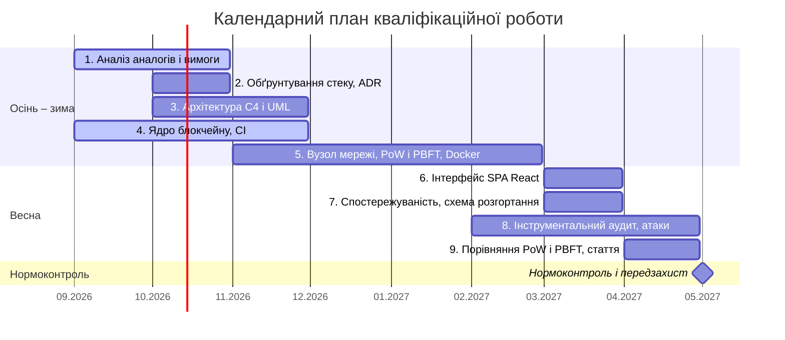

# Календарний план

Структура строго реплікує Лист завдання. Таблиця реалізована як база даних Obsidian Bases: кожен етап — окремий запис у папці `Calendar-Plan/` з типізованими полями. Етапи сформовано в сесії з LLM на основі наукового апарату ([[07-Scientific-Apparatus]]) та звірено з Implementation Plan (протокол — [[05-AI-Insights#ЛР №2 — Завдання 2. Календарний план|AI Insights]]).

![[Календарний план.base]]

## Roadmap (Gantt)

Етапи 1–5 (аналітика, архітектура, алгоритми, базовий код) завершуються не пізніше лютого 2027 р.; етапи 6–9 (інтерфейс, інфраструктура, аудит, апробація) — не пізніше квітня 2027 р. Травень 2027 р. зарезервовано під нормоконтроль і передзахист.

## Структура полів

| Графа | Властивість | Тип |
| --- | --- | --- |
| № з/п | `stage_no` | Number |
| Назва етапу кваліфікаційної роботи | `stage_name` | Text |
| Термін виконання етапів проєкту | `deadline` | Text (місяці, як у бланку) |
| Примітка / Статус виконання | `status` | Вибір: To Do / In Progress / Done |
| Завдання наукового апарату | `task_ref` | Text |
| Початок / Завершення (для Gantt) | `start`, `end` | Date |

Пов'язано: [[00-Dashboard]], [[01-Passport]], [[07-Scientific-Apparatus]]
