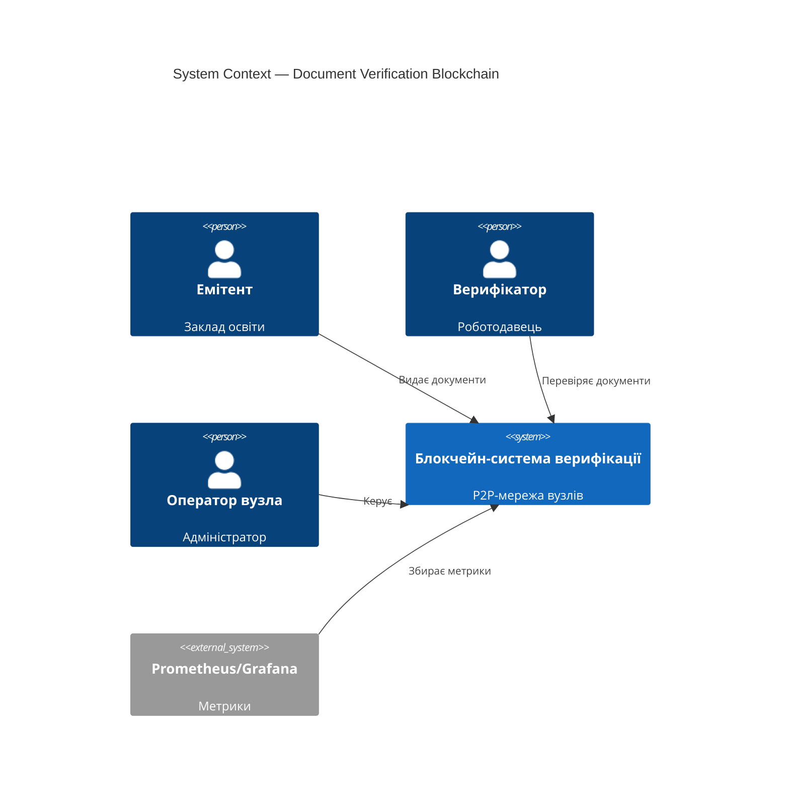
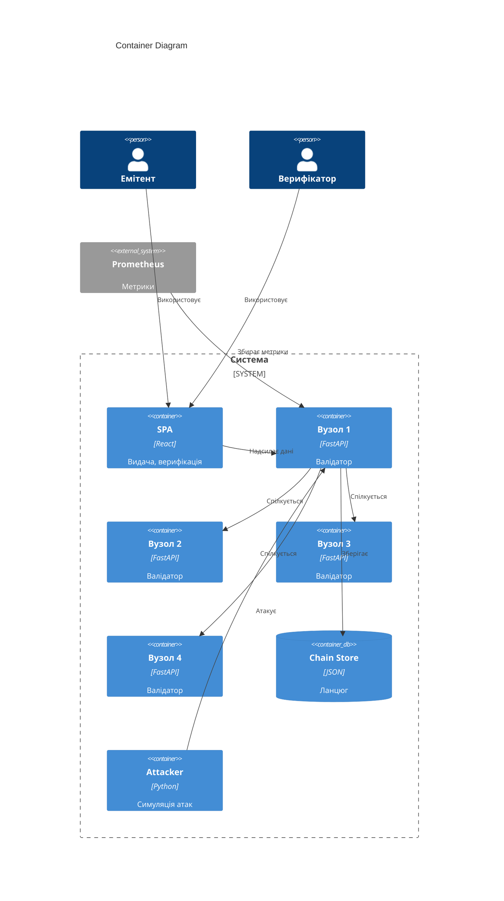

## C4 Level 1 — System Context (чернетка v0.1)

```mermaid
C4Context
    title System Context — Document Verification Blockchain
    Person(issuer, "Емітент", "Заклад освіти")
    Person(verifier, "Верифікатор", "Роботодавець")
    Person(operator, "Оператор вузла", "Адміністратор")
    System(sys, "Блокчейн-система верифікації", "P2P-мережа вузлів")
    System_Ext(prom, "Prometheus/Grafana", "Метрики")
    Rel(issuer, sys, "Видає документи")
    Rel(verifier, sys, "Перевіряє документи")
    Rel(operator, sys, "Керує")
    Rel(prom, sys, "Збирає метрики")
```

## C4 Level 2 — Container (чернетка v0.1)

```mermaid
C4Container
    title Container Diagram
    Person(issuer, "Емітент")
    Person(verifier, "Верифікатор")
    System_Boundary(b, "Система") {
        Container(spa, "SPA", "React", "Видача, верифікація")
        Container(node1, "Вузол 1", "FastAPI", "Валідатор")
        Container(node2, "Вузол 2", "FastAPI", "Валідатор")
        Container(node3, "Вузол 3", "FastAPI", "Валідатор")
        Container(node4, "Вузол 4", "FastAPI", "Валідатор")
        ContainerDb(store, "Chain Store", "JSON", "Ланцюг")
        Container(attacker, "Attacker", "Python", "Симуляція атак")
    }
    System_Ext(prom, "Prometheus", "Метрики")
    Rel(issuer, spa, "Використовує")
    Rel(verifier, spa, "Використовує")
    Rel(spa, node1, "Надсилає дані")
    Rel(node1, node2, "Спілкується")
    Rel(node1, node3, "Спілкується")
    Rel(node1, node4, "Спілкується")
    Rel(node1, store, "Зберігає")
    Rel(prom, node1, "Збирає метрики")
    Rel(attacker, node1, "Атакує")
```
