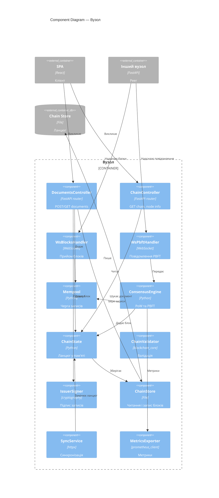

## C4 Level 3 — Component (чернетка v0.1): контейнер «Вузол» (FastAPI, Python 3, asyncio)

```mermaid
C4Component
    title Component Diagram — Вузол
    Container_Ext(spa, "SPA", "React", "Клієнт")
    Container_Ext(peer, "Інший вузол", "FastAPI", "Peer")
    ContainerDb_Ext(store, "Chain Store", "File", "Ланцюг")

    Container_Boundary(node, "Вузол") {
        Component(docapi, "DocumentsController", "FastAPI router", "POST/GET documents")
        Component(chainapi, "ChainController", "FastAPI router", "GET chain, node info")
        Component(wsblocks, "WsBlocksHandler", "WebSocket", "Прийом блоків")
        Component(wspbft, "WsPbftHandler", "WebSocket", "Повідомлення PBFT")
        Component(mempool, "Mempool", "Python", "Черга записів")
        Component(engine, "ConsensusEngine", "Python", "PoW та PBFT")
        Component(chainstate, "ChainState", "Python", "Ланцюг у пам'яті")
        Component(validator, "ChainValidator", "blockchain_core", "Валідація")
        Component(signer, "IssuerSigner", "cryptography", "Підпис записів")
        Component(repo, "ChainStore", "File", "Читання і запис блоків")
        Component(sync, "SyncService", "httpx", "Синхронізація")
        Component(metrics, "MetricsExporter", "prometheus_client", "Метрики")
    }

    Rel(spa, docapi, "Викликає")
    Rel(spa, chainapi, "Викликає")
    Rel(peer, wsblocks, "Надсилає блоки")
    Rel(peer, wspbft, "Надсилає повідомлення")
    Rel(docapi, signer, "Підписує")
    Rel(docapi, mempool, "Додає")
    Rel(docapi, repo, "Шукає документ")
    Rel(chainapi, chainstate, "Читає")
    Rel(engine, mempool, "Бере записи")
    Rel(engine, chainstate, "Додає блок")
    Rel(wsblocks, chainstate, "Додає блок")
    Rel(wspbft, engine, "Передає")
    Rel(chainstate, repo, "Зберігає")
    Rel(sync, chainstate, "Замінює ланцюг")
    Rel(repo, store, "Пише")
    Rel(engine, metrics, "Метрики")
```
