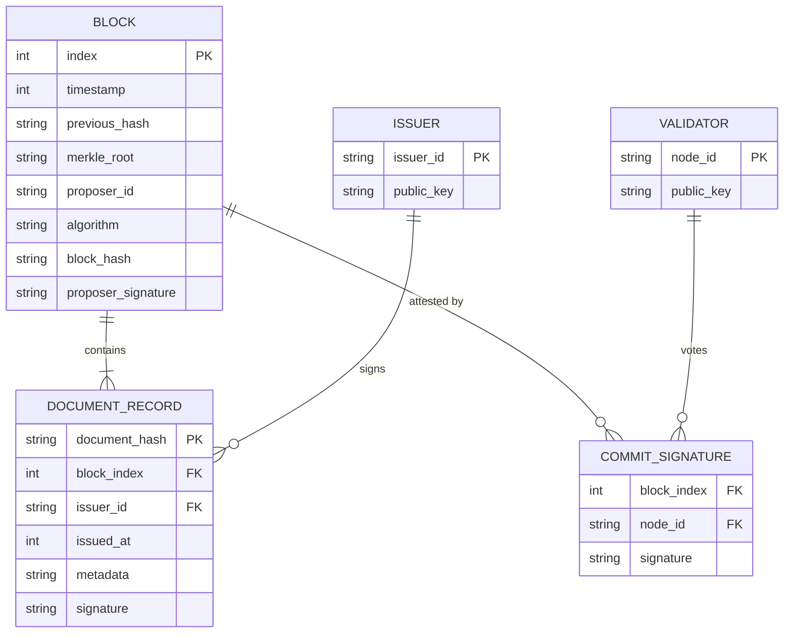

# LR6 — чернетка моделі даних v0.1 (до аудиту)

Стек: ChainStore (JSON / SQLite), Python 3, FastAPI. Первинний ескіз, підготовлений Claude Code до запуску ШІ-Аудитора.

```mermaid
erDiagram
    BLOCK {
        int index PK
        int timestamp
        string previous_hash
        string merkle_root
        string proposer_id
        string algorithm
        string block_hash
        string proposer_signature
    }
    DOCUMENT_RECORD {
        string document_hash PK
        int block_index FK
        string issuer_id FK
        int issued_at
        string metadata
        string signature
    }
    COMMIT_SIGNATURE {
        int block_index FK
        string node_id FK
        string signature
    }
    ISSUER {
        string issuer_id PK
        string public_key
    }
    VALIDATOR {
        string node_id PK
        string public_key
    }

    BLOCK ||--|{ DOCUMENT_RECORD : contains
    BLOCK ||--o{ COMMIT_SIGNATURE : "attested by"
    ISSUER ||--o{ DOCUMENT_RECORD : signs
    VALIDATOR ||--o{ COMMIT_SIGNATURE : votes
```
